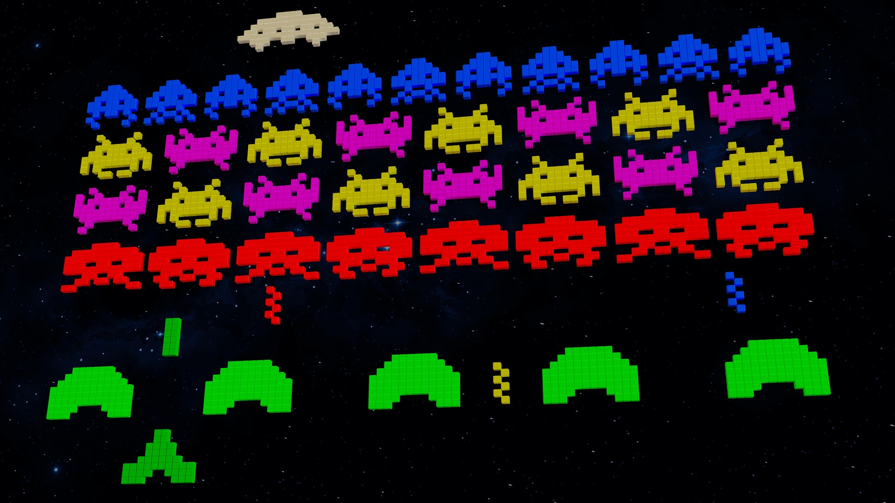

## Noblesse Oblige

Literally "Nobility obligates", or the obligations to others that come from being Nobility, there can be multiple interpretations of this word of French origins.

Through different forms of media, it can often be referenced in similar or broader terms:

"The strong must protect the weak"

"Those in power must protect those underneath them"

Even a certain famous line with spidery origins, "With great power comes great responsibility", can easily fall under this term.

Not all moments in the life of a Software Engineer may be as grandiose or life changing. However, sometimes even 4 simple words could change the lives of millions and have actions that cause waves around the world.

## It's Just a Job
I hear these words all the time. I'm even guilty of it myself. Working at some regular job that you're used to, going through the motions. You just want to clock in, clock out, and get paid. At the end of the day, that's all that matters right?

Of course not. **You're** the one in power right now. **You're** the one with obligations.

As a software engineer, you've got a lot to think about, some of which you might not even realize has at least a part in ethics.

Is this program easy to use for the end user?

Will the comments and code help someone else to understand what I've done?

Can this part of the code be exploited by a malicious user and is there checks to prevent that?

Is this code useful? Will it benefit people? How many? Who?

Though the last one may have gone a little deep, these types of questions have been drilled into my head through my years of learning programming and always help me keep the perspective of the end user and other peers in mind. It's with this type of thinking that you get a step closer to understanding ethics as a software developer.

Ethics to me is a complex combination of both human empathy and emotion with the hard logic that allows people to form a proper response and action to a given situation. Without logic, there is no reason. Without the human element, there is no morality. Only with these two combined with deliberation can someone act in a way that approaches the concept of being ethical.

In more simple terms, it's how we decide between what is right or wrong in a given situation. For a software developer, this comes in the form of your software itself, the practices you put forth, and your responsibilities as a professional. Things like making sure your code is helpful to both peers and the end user. Whether your company and partners are all well informed of any problems and issues that may occur and how they have been handled. Making sure your code is in working order and made to the best of its ability. Whether the program itself is accessible to as many people as possible and takes into account the differences between users. It's a lot to take in and is by no  means a complete list, nor can everyone can be perfect. However, taking steps to ensure you strive for that perfection, being willing to do your part to fix the mistakes you've made, and owning up to the consequences is just as important as not making the mistake in the first place.

While these things are all important to understanding ethics, not everything is always as surface level as this. Your responsibility as a fellow human being and the consequences of those actions need to be just as heavily considered. This is something that teacher Bill Sourour learned the hard way.

## A Series of questions
As mentioned in [his essay](https://www.freecodecamp.org/news/the-code-im-still-ashamed-of-e4c021dff55e/#.tsjl7lkxy), a young Bill Sourour had landed a job working in coding for a marketing firm with a focus on medicine. His current assignment was to make a quiz that gave a recommendation of different drugs after answering some questions. At least on the surface this seemed harmless, but it is revealed that as per the client's instructions, nearly every choice should lead you to their drug they were trying to push unless you confirmed you were allergic or already taking it. Of course, to the young programmer, this was simply marketing and was just what his client wanted. What's the worst that could happen?

He received his answer quickly enough. Soon after the site went up, a report of a girl who took the medicine had committed suicide. Due in part to his ignorance, it's possible a girl was no longer alive. What was more, his sister had been taking the same medicine. Thankfully she was convinced to stop and was otherwise safe, but since then even more incidents have been popping up.

This is the type of thing that ethics hopes to prevent. By looking deeper into the situation and seeing things from other's perspectives, it can help you better understand what's happening around you and apply that to your work.

Though you can tell they are pushing their product by rigging the website, by looking at it from their perspective you may realize that it's odd they would need to rig the site for their product in the first place. This could possibly mean they have a reason they need to falsify that decision. Asking questions can be the start to finding the answers that lead to changes in your decision making.

Looking at it from the perspective of an end user, unknowingly being lied to would probably not go over well with most people. Putting yourself in their position, it could be easier to understand that what's going on may not sit well with you. This could have led to asking himself whether rigging the quiz was really okay.

In my personal opinion, while I do think that from an ethical standpoint he could have done more to find out about the client he had taken, he shouldn't take full blame for what had happened. There's no conclusive proof that his quiz was directly the cause of the deaths and he showed remorse for what had happened by resigning. This situation is also difficult due to the delicate situation and whether or not anything else could have been done after the fact. Outside of starting or donating to an organization that helped against these types of things, there's only so much I can think of in a situation like this.

If I were in this situation, at least before releasing this quiz, I would have probably tried to find out about the client company. Had I found any information about possible negative side effects I would have tried talking to my supervisors or peers about this information. The alternative having to consider the effects of being more vocal about this client or leaving the job should the company be fine ignoring what I have brought up. Having done at least this much, I think I would have been in a much better position to weigh my options and come to a decision about the project and my future.

I don't know if I have enough information to be able to fully put myself in the situation and decide what I would have done. However, knowing that they were being openly deceitful with something that involved medicine, that alone would probably be enough to make me avoid taking the job if at all physically possible and say something. That goes against the interests of the people as a whole as well as my morals as an individual.

## In Conclusion
