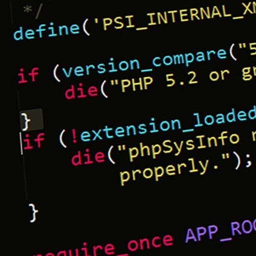
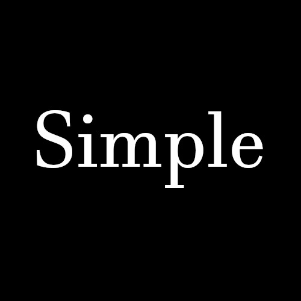

I have worked on a lot of languages after multiple years of classes. Things like Python, Java, Perl, C, C++, JavaScript, PHP, HTML, and some I've probably missed. While they tend to blur together in places, I remember JavaScript quite clearly. This is round two with it and the main thing I remember is this: I don't have to worry about type.

No int.

No char.

No str.

It's **liberating.**

Put simply, I didn't need to worry about clarifying whether something is a number, a letter, a line of text, or otherwise.

## How I feel about JavaScript

Personally I think I'm pretty good at keeping track of my code and being able to keep variables in line. So learning early languages like Java where I have to constantly be aware of the type, or make sure I properly convert them into another was always a pain. It did teach me the importance of attention to detail and keeping tabs of your variables at all times, of course. However, not freaking out over how I get this line of text to a certain type of number and back again is always welcome.

## Learning ES6 style

There's always room for improvement and learning things like ES6 definitely count. Having a guideline for how to code and format it all properly is really handy and makes it easier to pick up another person's code and read it. Some of the more basic things like using const and let to declare variables were thankfully taught in other classes for things like C and C++, so I'm not unfamiliar with them. The different naming conventions for different structures and formatting may take a little while though. Not typing double quotes instead of single quotations is something I definitely haven't gotten used to and it's hard to not instinctively hit shift before I start a string.

## Javascript as a software engineering language

Overall the JavaScript seems like it has the potential to be a good software engineering language. It's built to work in things like webpages, so it's already a good starting point for interacting with other applications and services. It's also a seemingly straightforward language compared to some other languages that are more picky that may get in the way of working properly. This could also be seen as a downside depending on how sloppy the code gets. It may be more easy to run into issues in that sense, though that is more human error at that point.

## Athletic Software Engineering

Athletic software engineering and the practice WOD are new to me, but I see the long term benefits if I keep at it. WOD, or Workout Of the Day, is a timed practice problem that the class is asked to solve. When you are given a time limit and being put into a more pressured situation is scary, but it's also good practice for working under pressure and keeping your brain running until the very end. Distractions, typos, and other poor habits all work against you in these sessions and they make for a good trial under fire type of deal. They also teach you to read carefully and pick out the important details so you can process the information faster. As long as I keep up with the class and understand what I'm doing, I think the WOD's will be a good step towards getting better at coding in general.
