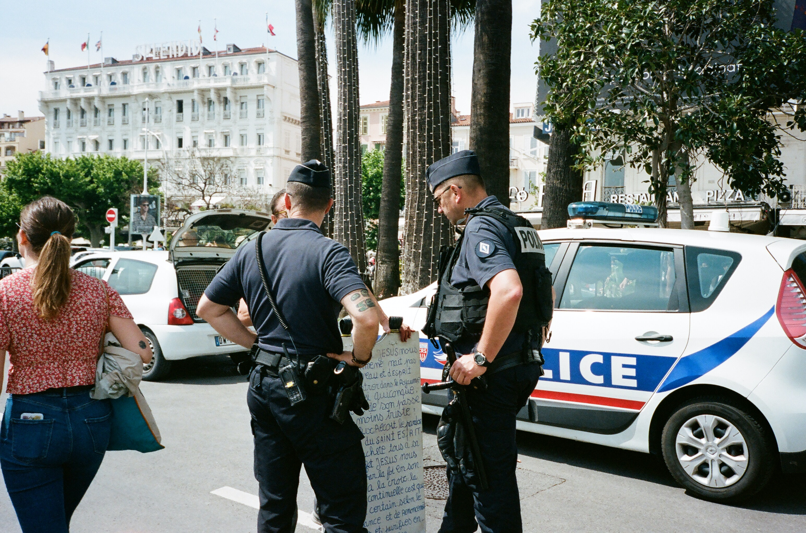

## A Day In the Life

A lone man waits on a city curb for someone. Their hoodie and jeans don't make them stand out on this regular night like any other. After a good half an hour, they finally look up as they see someone they know. After their initial greetings, the air becomes a lot more tense. After a glance back and forth, reaching out of his pocket, a small bag the size of a dime is passed between shaky hands. With the bag inspected, and safely put away, the tension lifts and the two part ways quickly. The hooded man walks into the nearby alley and pulls out his police badge from his pocket to reach his phone. With a quick phone call, he sends the go ahead. They've got their guy.

The police back at the office are thrilled that their undercover cop had gotten the information and evidence they needed. All they need to do now is to send someone in to handle the job. To do this, they hand things over to dispatch and they send a message to the cops in the area. They need someone to get to a certain address. If they're lucky, they can catch the dealer there and they can finally close this case. A police officer responds quickly, and they're off to the address. Soon after, they get another phone call.

Sprinting through the alleyways with gunshots echoing across the walls of the buildings, the undercover cop, having abandoned his hoodie to increase his speed, turns a corner. Perhaps he should have been more careful. While trying to contact headquarters, having pulled out his badge, the dealer had doubled back to ease his suspicions. Upon seeing the shiny piece of metal, he decided to call for his own backup. Within minutes, the cop had found himself being chased through the back alleyways. Phone in hand, he waited for headquarters to pickup. The information had changed.

## Patterns Repeat Itself

Design Patterns are kind of like a template. Its name is pretty self explanatory. There are certain problems that may occur in any number of given situations. Once recognized as a pattern, if a solution is found then you should be able to take that answer and apply it to the other situations within that pattern. Over time new, and hopefully more optimal, solutions for the situation can be found, and these design patterns are what you get. That way if the situation is encountered again elsewhere, the answer is already readily available.

Though there are many design patterns for all kinds of different interfaces, languages, even professions, there are a few that I'd like to go over, both in respect to what they do in my code, as well as how they apply to the short story up there.

## Model-View-Controller Design

This design is sort of a bigger picture style of design which covers the way a web application runs its data and displays it to the user as a whole. The model establishes the database and the backend of the website, the view establishes how the visual displayed on the site is set up, and the controller allows the interaction between these two parts to go smoothly. Even within this design the parts you use for each section can be interchanged and swapped out as necessary depending on the necessities required.

In some ways, this design works like an outfit. There's different appearances for different occasions and how you prepare for that appearance using makeup, pins, clips, all that aren't necessarily meant to be seen are the backend making it work. How you apply those things and adjust them to make yourself look good is how you interface between the backend and the outward appearance.

Looking like a cop for instance, may be a good way to get a civilian's attention and compliance. A bullet proof vest, holsters, and other more concealed pieces help to interface with potential situations encountered by the officer. In a situation where you're undercover, that's just going to make you stick out like a sore thumb.

## Observer Design

Speaking of undercover cops, observer designs work a little similarly. Being undercover, they passively listen in on the situation and if something of note happens, they can report it back to the interested parties.

In the same way, observer design is meant to have parts which know to notify the observers when something they're interested in happens, letting the rest of the relevant components know to do something.

This is used frequently with buttons and other interactive elements that listen for an interaction so they can be told to submit a form, or change the input data.

## Publish-Subscribe Design

When the police receive information that needs to be relayed to the other's driving around the city, they send it through dispatch. They send a message to all the vehicles, so that if there's anyone nearby, they can respond to the message. They don't necessarily know who's going to use that information or receive it, but their goal is simply to collect that information and put it out there.

This is at least a little similar to how a publish-subscribe design prepares its published messages to be ready for interface with subscribers. While it readily prepares that information, it simply sends it to another interface that handles who wants that information and lets it handle who it is sent to instead.

In our web application, we use a lot of published collections and subscriptions to help send and receive information as required to the different pages as necessary.

## Singleton Design

Now that you have these published collections, what happens to the information that these publications send out? You don't necessarily want to connect to the entire database or publication itself. Instead you can use a single instance of that database to display, alter, or adjust instead.

This is the cops receiving the information through the radio. They're listening for the information given and using that information they can apply it to their current patrol. Whether it's to deviate from their current patrol, keep an eye out while they continue, or ignore it and let another cop handle that information instead. What they do with that information is also completely different from another cop on patrol, having little to no bearing on another patrol car.

In our web application this is used in conjunction with the publish-subscribe design to help handle information based on what's required by each page and component. That way we can get specific information or data as necessary.

## Reactive Data Design

When police headquarters finally got that phone call by the end of the story, a lot of things probably had to have happened and they'll need to change their information. Not only is the address search probably a no-go, they'll probably want to instead have their cops sent on their way to assist in the one currently being chased through the streets. It's this fast reaction to the change that may save that cop's life.

In a web application, the fast reaction to change is important in a different way. Displaying outdated information is messy and potentially disastrous. This is why you want to make sure that if anything changes in the data, that your website updates to reflect that.

This is shown in our web application as deleting and editing data through our web page will visually update the change and the post that has been deleted is not listed anymore.

## Last Paragraph

