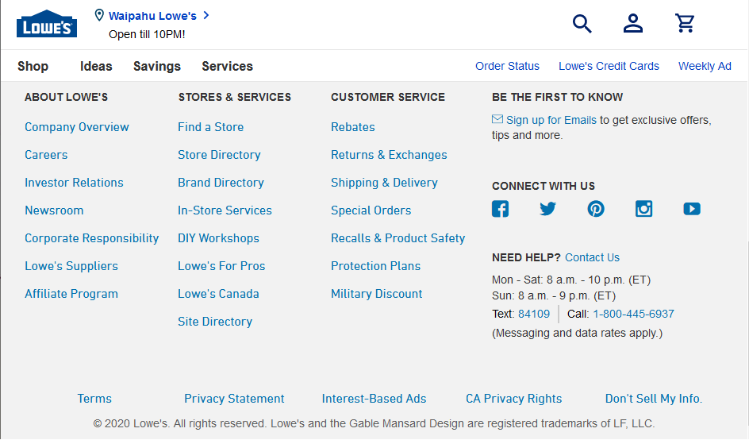
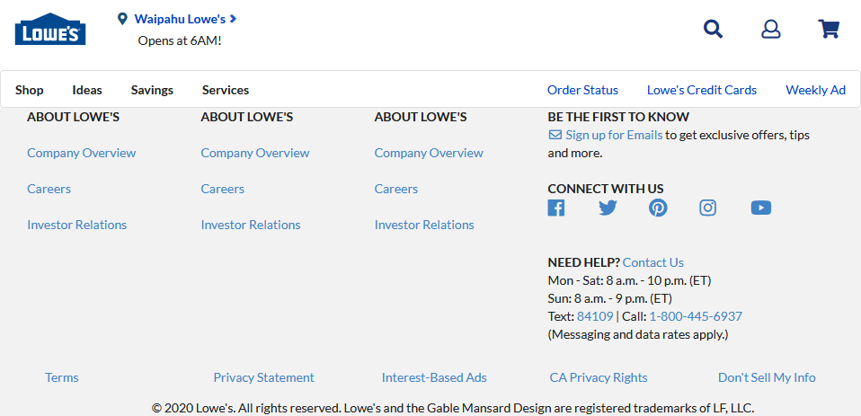
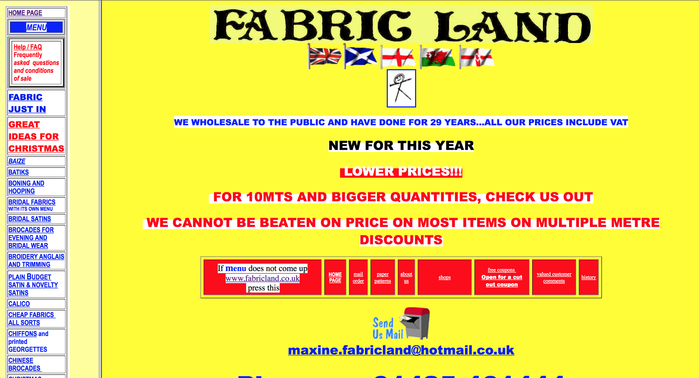
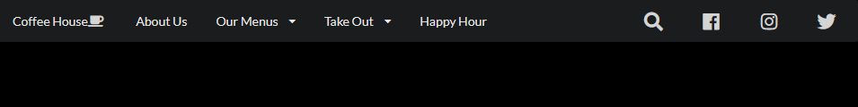

*Would you be able to tell which website is the real one and which is the mock-up? Thanks to Semantics UI, this was much easier than you'd think.*

## My Feelings Towards HTML
Though I wouldn't say I'm completely familiar with HTML as a language, I've been working with it for multiple classes now. Each time I do it feels like such a love/hate relationship and it makes me uneasy. On one hand it's a lot more straightforward when you're trying to get it to do something unlike a regular coding program. On the other, it's a lot harder than it looks to get it to stay that way regardless of the situation.

It's a problem of *knowing* that you can set it up to look nice in the current browser window. The difficulty is whether it will stay that way when you adjust the page a little, maybe a bit wider, or a little shorter. Maybe that picture is set up nicely where it's supposed to, but does one adjustment make it jump somewhere else? Trying to keep your page from falling apart can be quite the mess. Especially since you'll likely be juggling that responsibility with CSS as well.

## Becoming a CSS Fashionista
CSS in comparison is a lot more simple in execution and more familiar territory. Select a place, object, or group on the page as a base and throw a few lines of code in to move it or make it look pretty. It's really versatile and can help your page go from an old 2000's blog to a professional website for some famous company. Of course beauty comes at a price. Those blocks of code can become pretty hefty depending on how much formatting needs to be done.


*You use CSS, so your website doesn't look like this*

CSS can be a one stop shop for everything from position, text, shape, style, etc. This also means there's a lot to keep track of just to make your page look uniform. Paired with the amount of options to edit each part of the page, it can be overwhelming to get things just the way you want it.

If only there were a way to cut down on the fiddling on the HTML side and make less work on the CSS end...

Just kidding, Semantic UI is one way to do just that.

## Semantics UI Is Just That Simple
If raw HTML and CSS is like trying to talk to someone in a different language that you only sort of understand, Semantic UI is getting a translator to do the job for you. Not only do you get the point across, you were able to do it in a language that makes more sense to you.

Semantic UI has a lot of individual parts that when put together, make the web page experience easier as a whole. With many built in components that you see on a regular basis in websites, all with easier to understand syntax, with a little work you can make some really impressively formatted web pages. Not to mention transformative properties using its syntax also streamlines the entire process and are applicable to the majority of its components.

## Less Is More

Let's say you want a menu.  You may start out with something like:
```HTML
<div class="ui grid menu"></div>
```

Just like that you have a menu that's ready to be filled with stuff at the top of your page. The grid is a neat feature that sort of divides the space cleanly so you don't have to.

However, your page is black, so that menu needs to be black with white text instead. Instead of reaching for that open CSS stylesheet, how about we add a single word instead:
```HTML
<div class="ui inverted grid menu"></div>
```
Just like that your menu has inverted its colors and you're ready to add the meat and bones of the menu.

For that, you need to make sure people know about the people making your page, so you want the first thing in your menu to be an 'About Us' link. Not only that, but you also need a search icon in the opposite corner:
```HTML
<div class="ui inverted grid menu">
  <a class="ui item" href="about-us.html">About Us</a>
  <a class="ui right item" href="search-site.html">
    <i class="search icon"></i>
  </a>
</div>
```

Now you have your very first 'About Us' item at the top of your page, but also a small magnifying glass in the opposite corner ready to take them to their page. That's right, built in icons for your page building pleasure. Their icon list is also pretty expansive, including all the expected classics, on top of icons for newer social media like Twitter and Facebook.

Another thing to note is that all you needed to do to shove the magnifying glass to the right is add 'right' to the class. No adjusting the CSS at all.

Lastly, maybe the search icon wasn't big enough.  Perhaps if it was **large** it would be just right:
```HTML
<div class="ui inverted grid menu">
  <a class="ui item" href="about-us.html">About Us</a>
  <a class="ui right item" href="search-site.html"><i class="large search icon"></i></a>
</div>
```

That's right.  Just like the menu and the item classes, you can throw a size in there and adjust the icon's size as you see fit.

With only a few more additions and minor adjustments to the CSS, you can get a menu that looks something like this:



This is the beauty of Semantics UI. You get good looking results and for small adjustments, you just need to know the magic word and suddenly it's done.

Of course, for even more precise adjustments you've always got CSS to iron out the details and changing one line for a color change or padding adjustment feels like nothing when you skipped all the extra steps with a couple words.

## Why Semantics UI?
If the benefits weren't clear already, Semantics UI gives you a lot of extra site building tools at your fingertips. It cleans up the code and makes it a lot easier to understand and make changes to. It's also friendly with CSS and allows you to make adjustments to get your site looking exactly how you want it.

In a way, you could say Semantics UI has fixed my relationship with HTML. All I had to do was use my words.
