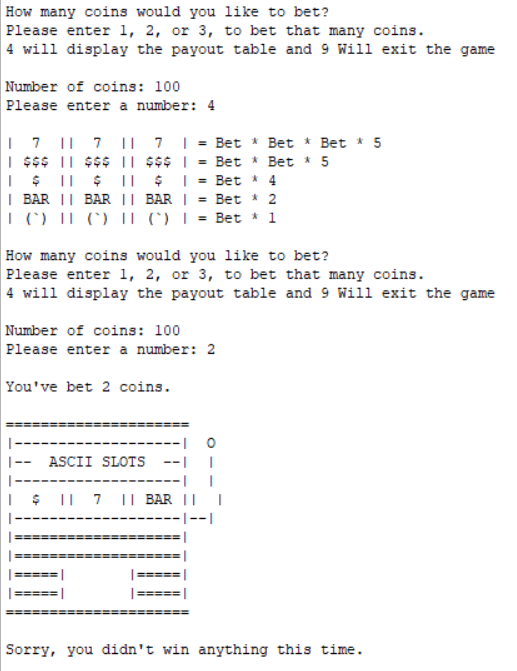

The goal of this assignment was to make use of at least 5 different functions and techniques learned during our ICS 212 class up to that point in C. Though as long as we used the same function in different ways, we were able to make use of the same things multiple times. While others may have come up with more simple and practical applications, I've always had a fascination with games and enjoy coming up with ways to implement them. Of course this was the first thing I could think of so I got right to work.

While it was daunting at first, especially for something that could have been much simpler in scale for what was required, I couldn't picture myself doing anything else and powered through. The program itself is pretty straightforward. Upon startup it asks the user to pick a game and then plays the game with the user after explaining the rules. After the game is completed it asks the user if it would like to keep playing and either resets the game and continues or closes itself.

Here's a look at some of the games running itself:

<div class="ui medium rounded images">
  
</div>

This is the dice game, a very simple dice rolling game that compares your dice against the opponent. You get 3 dice and random choose to remove 1 of them. Your other 2 dice are revealed, and if either of them are higher than the opponent's dice, you win the round. The goal is to win one game within five rounds.

<div class="ui medium rounded images">
  
</div>

This is the classic guess the number game. It's a bit more thought provoking and requires a bit more thought to actually win this one instead of pure chance. The program will generate a random number between 1 and 1000 and the player will have 15 guesses to narrow it down. After each guess it'll tell you whether the number was higher or lower.

<div class="ui medium rounded images">
  
</div>

Lastly, we have a slot machine. This is the most simple mechanically, but probably the most complex in terms of visuals and code. It asks the player how many coins they want to bet between 1 and 3, and the slot machine spits out 3 symbols. Based on the matching symbols there's different payouts or none at all. Under the hood of the game, the program is built to work similarly to a real slot machine and has 3 reels which have differing amounts of each symbol on them. This creates the varying probability of each outcome and means the chances are weighted differently.

Through finally finishing this project and seeing it complete, I was able to see more clearly how to start putting various tools together and different applications of them. Through the slot machine it also helped me get more practice in at building a visual interface and presentation. It was also a great way to see how expansive I could get with my projects in a limited amount of time.

Here is some code that shows the generation of the random slot reels, part of the ASCII being built on screen, and how reel 1 decides what to display and represent for payouts:

```c
//Randomizes the slot rolls
      slotOne = 1 + rand() % 14;
      slotTwo = 1 + rand() % 14;
      slotThree = 1 + rand() % 14;
      printf("=====================\n");
      printf("|-------------------|  O\n");
      printf("|--  ASCII SLOTS  --|  |\n");
      printf("|-------------------|  |\n");

      //Displays an orange in the first slot if number is 1-5
      if (slotOne == 1 || slotOne == 2 || slotOne == 3 || slotOne == 4 ||
      slotOne == 5) {
        printf("| (`) ||");
        slotOneFace = 1;
      }
      //Displays BAR in the first slot if number is 6-8
      else if (slotOne == 6 || slotOne == 7 || slotOne == 8) {
        printf("| BAR ||");
        slotOneFace = 2;
      }
      //Displays $ in the first slot if number is 9-11
      else if (slotOne == 9 || slotOne == 10 || slotOne == 11) {
        printf("|  $  ||");
        slotOneFace = 3;
      }
      //Displays $$$ in the first slot if number is 12 or 13
      else if (slotOne == 12 || slotOne == 13) {
        printf("| $$$ ||");
        slotOneFace = 4;
      }
      //Displays a 7 in the first slot if number is 14
      else {
        printf("|  7  ||");
        slotOneFace = 5;
      }
```


The C program and makefile can be found [here](http://bit.ly/2Rid7hY)
