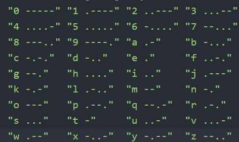

The Morse Code Translator was an assignment that had us take the given morse code array by the teacher and use it to decode any input morse code through the arguments. Morse code is a combination of dots, dashes, and pauses that turn into things like numbers or letters shown below:

  

The program was helpful in practicing using the arguments through command line to read in more information as well as error checking with the command line and arguments as well. This was a short and sweet assignment that let us mess around with something we normally wouldn't use.

If I were to work on this project again, I'd like to set it up to read "morse" or "english" as the first argument. Then based on the input, translate morse code into English or vice versa. That way the program is more versatile and allows people to use it to send "secret" messages to others and decode them.

A link to the program and makefile can be found [here](http://bit.ly/37kVkfr)

